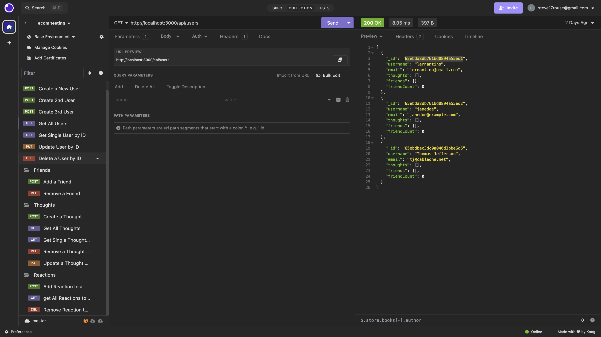

# Social-Net API

## Description
This API is the backend to a social network. It is deigned to run CRUD operations against Users, Friends, Thoughts, and Reactions.

## Table of Contents
- [Installation](#installation)
- [Sequence Diagram](#sequence-diagram)
- [Demo Video](#demo-video)
- [License](#license)
- [Contributing](#contributing)
- [Tests](#tests)
- [Questions](#questions)

## Installation
For dev use only,  use 'node seed.js' to seed the NoSQL database. Upon command line confirmation of a successful seed, run 'node server.js to start the server.  Then by connecting to Insomnia, you can test the CRUD routes for proper operation. 

## Sequence Diagram

## Demo Video

For more operating details, see the [working demo video](https://drive.google.com/file/d/1CH-dvOD4p0ZLeCu0xYLWeof3VWzE0Dcy/view)

## License

This project is licensed under the MIT license.

## Contributing
n/a

## Tests
Use Insomnia to test CRUD operations. For example, to test GET all users route:

## Questions
For questions, contact steve17rouse@gmail.com. Visit [GitHub](https://github.com/stever001).
